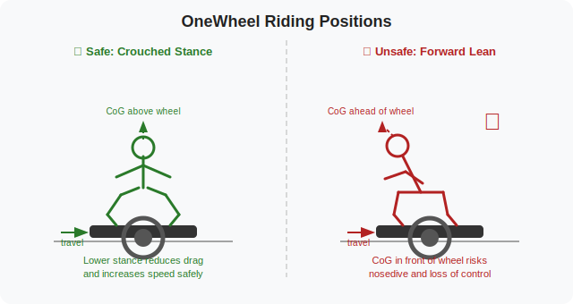

# OneWheel

crouch to increase your speed by reducing drag. leaning your center of gravity in front of the board is unsafe and should be avoided. 

try to avoid pushing maximum speed when you're nearing the last 30% of your battery. otherwise you risk the chance of the battery suddenly giving out